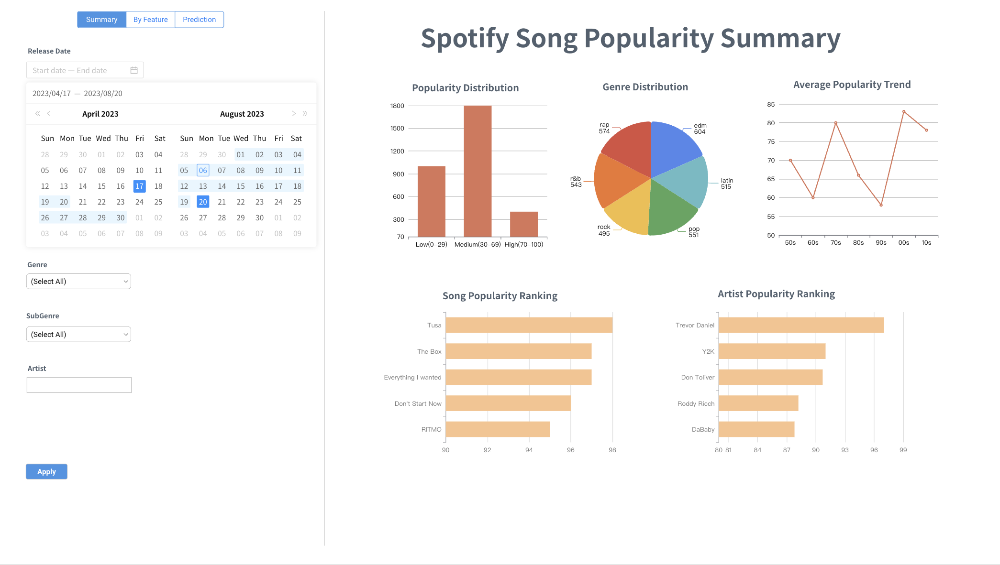
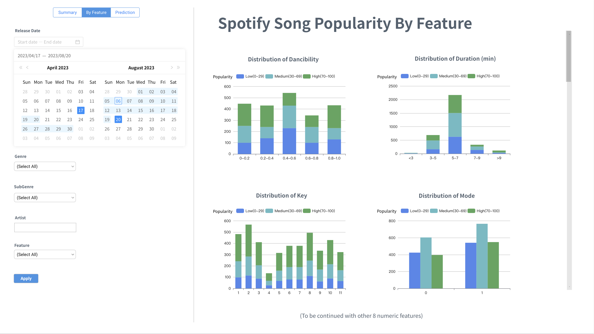
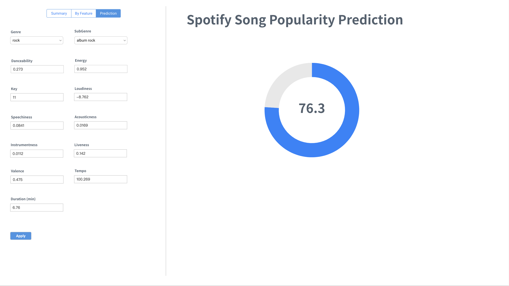

# SongPopularity 

The app presents a detailed overview of song popularity on Spotify, offering users the ability to explore various metrics and their impact on a song's success. This dashboard application is divided into three sections, each with different functionalities. 
## **Summary**
In the "Summary" section, users can find visual representations of the general distribution of all songs' popularity, as well as breakdowns by different genres and rankings of songs and artists. Users are able to filter the data by release date, genre, and artist to tailor the analysis to specific interests, which is particularly useful if users look to focus on a certain timeframe or music style.
## **Song Features**
The second section allows users to explore how song popularity is distributed across the technical features of the songs, including danceability, duration, key, modality, and more. Users can select and customize filters via a dropdown menu for their own purposes. These metrics are displayed using bar charts and histograms, allowing for an immediate comparison of how these features distribute among popular and less popular tracks. This filter functionality informs users about which musical qualities are trending in popular songs.
## **Prediction**
The final "Prediction" section offers an interactive feature where users can input song characteristics to predict its popularity score. By adjusting factors like danceability, energy, key, and loudness, users can see how these changes might affect a song's potential success, represented by a dynamic, updating popularity score.

Overall, this dashboard serves as a practical tool for spotting trends, understanding the musical landscape, and making data-driven decisions in the music industry. Whether you're a marketer looking to promote the next big hit or an executive deciding on which artist to sign, this dashboard provides the insights needed to stay ahead in the fast-paced world of music.

## **Sketch**

