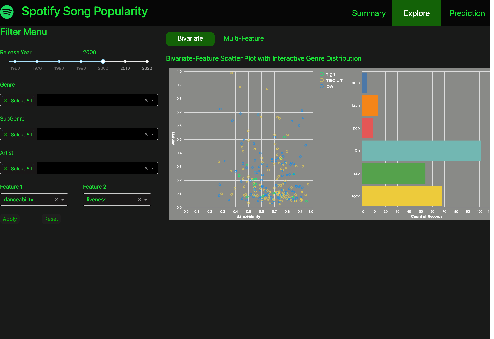
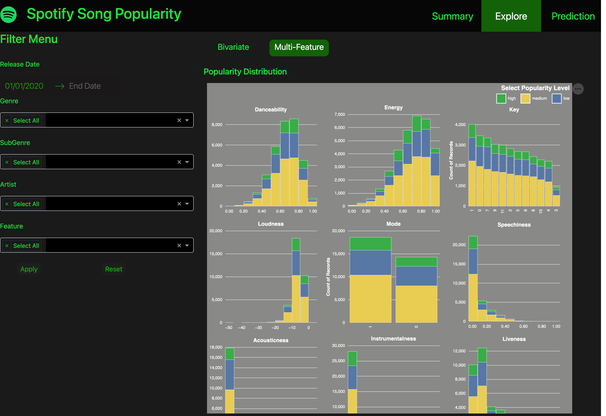
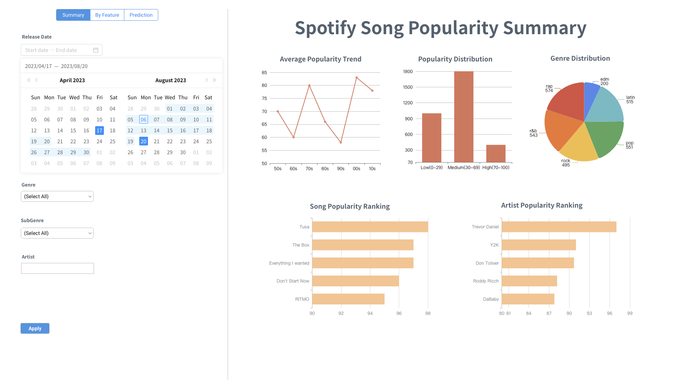

# SongPopularity 

The app presents a detailed overview of song popularity on Spotify and serves as a practical tool for spotting trends, understanding the musical landscape, and making data-driven decisions in the music industry, offering users the ability to explore various metrics and their impact on a song's success. Whether you're a marketer looking to promote the next big hit or an executive deciding on which artist to sign, this dashboard provides the insights needed to stay ahead in the fast-paced world of music.
 

This dashboard application is divided into three sections, each with different functionalities. 

## **Summary**

In the "Summary" section, users can filter the data by release date, genre, subgenre and artist to tailor the analysis to specific interests and can then find visual representations of the general distribution of all songs' popularity, the average popularity trending, as well as breakdowns by different genres and rankings of songs and artists. By clicking on one of the top songs and the play button below, users can visit the spotify website to listen to this song directly. 

## **Explore**
The "Explore" section is splitted into two parts:

- Bivariate Popularity Analysis:

User can selected a specified year (default year is 2000) and two features, and filter data by genre, subgenre and artist to explore how these two features are correlated through a scatter plot with three different colors denoting songs' popularity levels, along with a linked bar chart showing the respective genre distribution. 

- Multi-Feature Popularity Analysis:

Users can filter data by genre, subgenre and artist and select features to explore how song popularity is distributed across the technical features of the songs, including danceability, duration, key, modality, and more. These metrics are displayed using bar charts and histograms, allowing for an immediate comparison of how these features distribute among popular and less popular tracks. This filter functionality informs users about which musical qualities are trending in popular songs.

## **Prediction**

The final "Prediction" section offers an interactive feature where users can input song characteristics to predict its popularity score. By adjusting features like danceability, energy, key, and loudness in the filter menu, users can see how these changes might affect a song's potential success, represented by a ring chart showing the predicted popularity score and a radar plot showing the values of those features.

## **Original Sketch**

